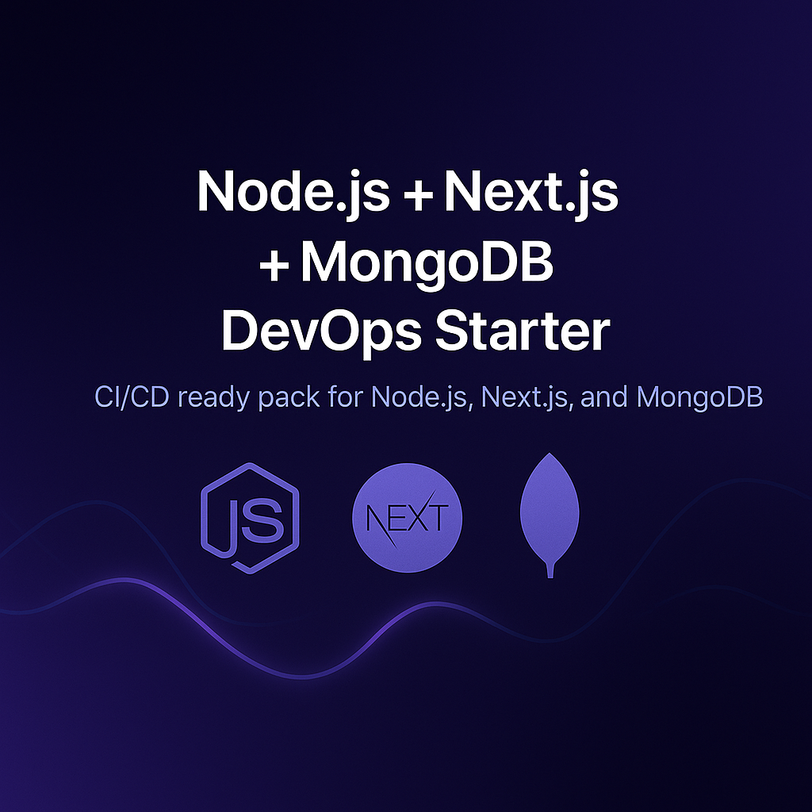

<p align="center">
  
</p>

# 🚀 Node + Next + Mongo DevOps Starter (CI/CD Ready)

A production-ready **DevOps Starter Pack** for modern developers.

- 🐳 **Dockerized** backend & frontend
- 🔄 **CI/CD** with GitHub Actions or GitLab
- 📊 **Monitoring** (Prometheus + Grafana)
- 🚀 Ready for local & cloud deployment

---

## 🧩 Tech Stack
Node.js · Next.js · MongoDB · Docker · GitHub Actions · Grafana · Prometheus

---

## 📦 Get the Pack
➡️ **Gumroad**: https://jalalelb.gumroad.com/l/node-next-mongo

> Looking for all stacks?  
> **DevOps Starters Collection** → https://github.com/JalalELB/devops-starters-collection

---

## 📊 Example Architecture
```text
frontend ──► backend ──► database
     │              │
     └──► monitoring (Prometheus + Grafana)
```

---

## 🧑‍💻 About the Author
**Jalal El Boumeshouli** — Full-Stack & DevOps Engineer  
💼 https://www.linkedin.com/in/jalalelb
🛒 https://jalalelb.gumroad.com
