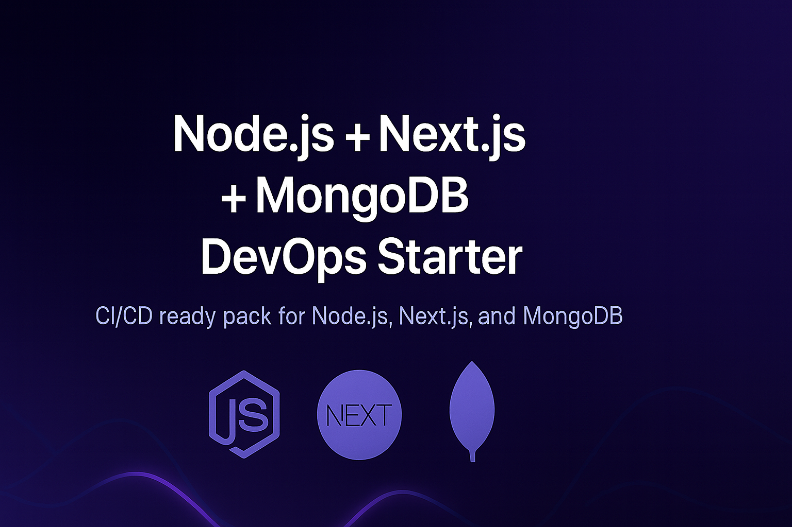

<p align="center">
  
</p>

# 🚀 Node.js + Next.js + MongoDB DevOps Starter (CI/CD Ready)

A production-ready **DevOps Starter Pack** for full-stack JavaScript developers.

- 🐳 **Dockerized** backend & frontend
- 🔄 **CI/CD** with GitHub Actions
- 📊 **Monitoring** (Prometheus + Grafana)
- 🚀 Ready for local & cloud deployment

---

## 🧩 Tech Stack
- Node.js (API backend)  
- Next.js (React frontend)  
- MongoDB (database)  
- Docker · GitHub Actions · Prometheus · Grafana

---

## 📦 Get the Pack
➡️ **Gumroad**: https://jalalelb.gumroad.com/l/node-next-mongo

> Looking for all stacks?  
> **DevOps Starters Collection** → https://github.com/JalalELB/devops-starters-collection

---

## 📊 Example Architecture
```text
frontend ──► backend ──► database
     │              │
     └──► monitoring (Prometheus + Grafana)
